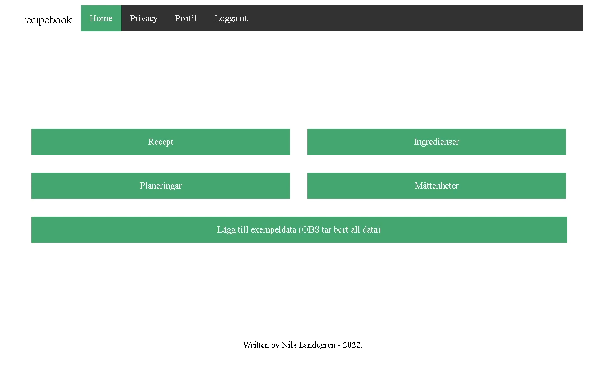
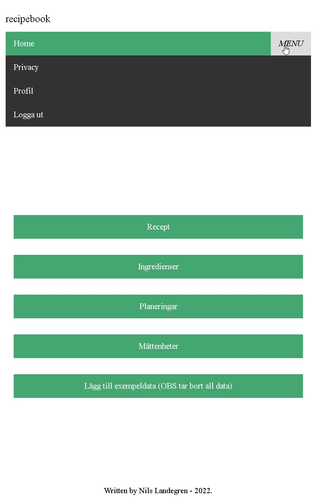
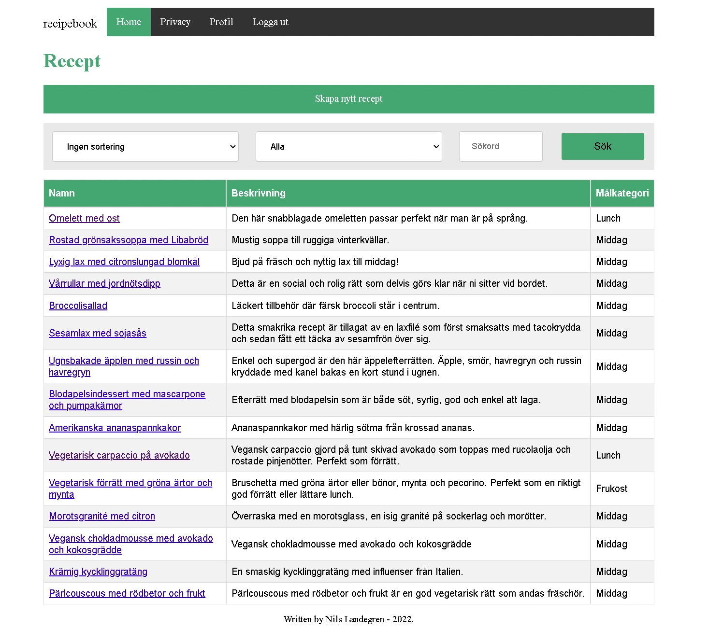
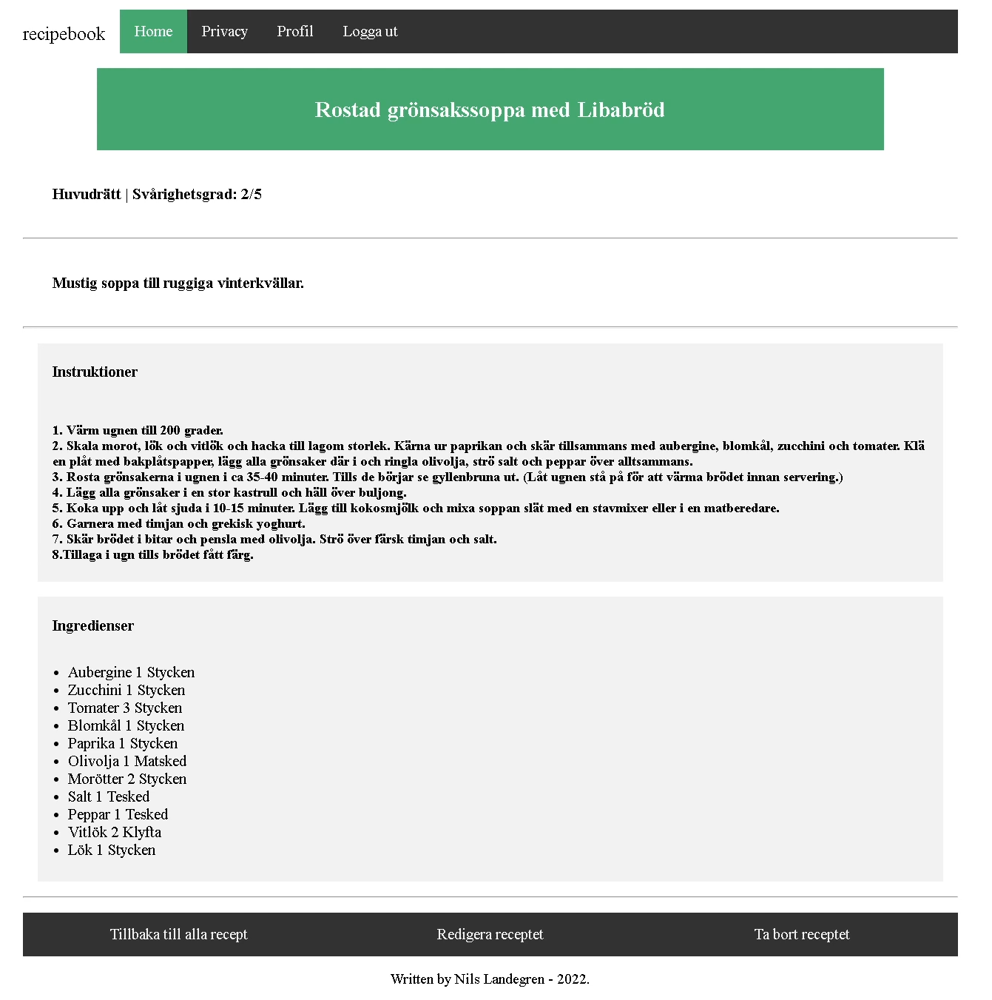
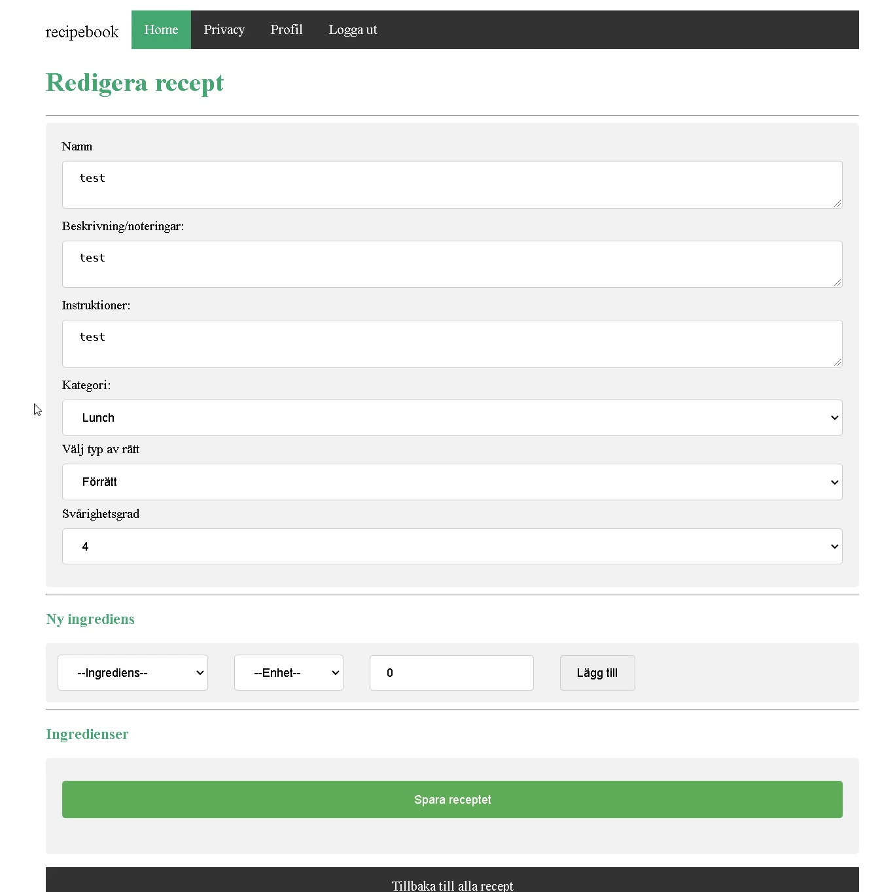
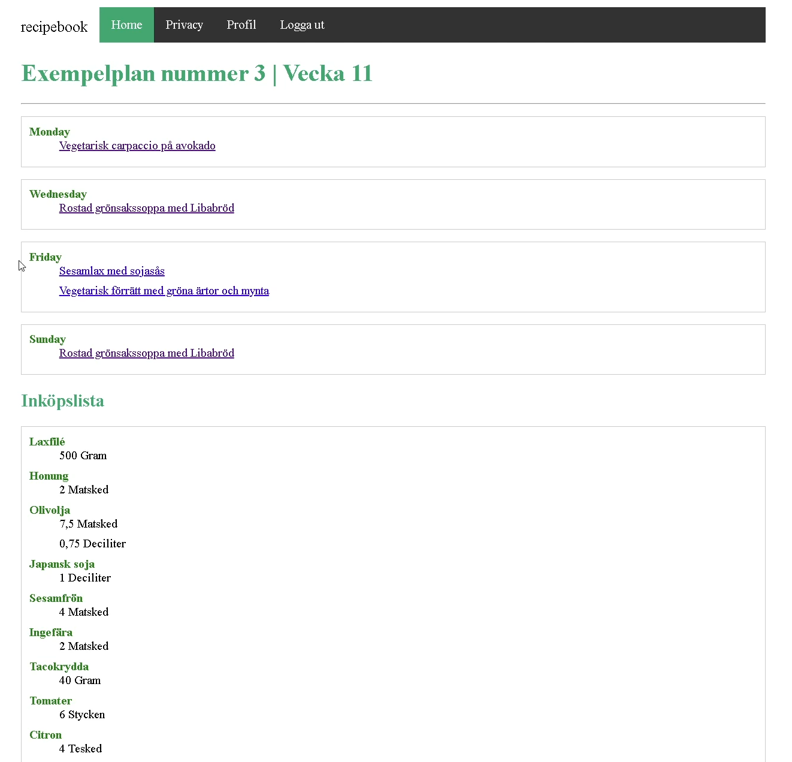
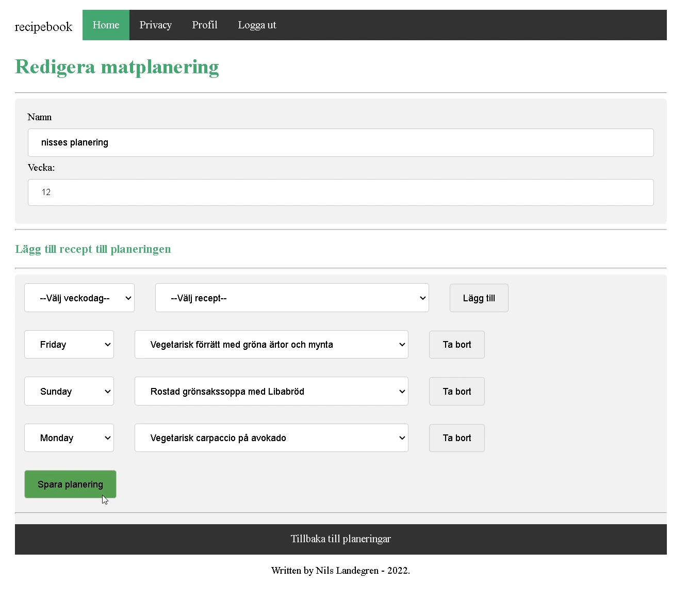
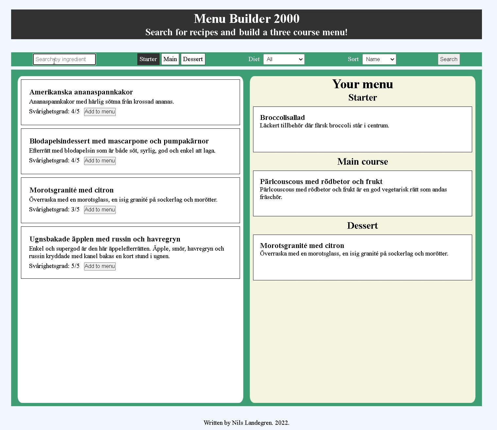

# recipebook: a full stack web application

A web application used to create and manage food recipes as well as creating weekly meal plans.

The app is implemented in ASP.NET Core using Razor pages. I implemented account authorized CRUD operations for each of the categories Recipes, Meal Plans, Ingredients, and Measurement Units. As part of the assignment I also built an API that gives access to a subset of the database. 

The project is the result of a course in web development backend, which was one of the courses in my two-year programme in .NET development. I built this app as part of an assignment in which I was supposed to leverage most of what I had learnt in previous courses, including:
* programming in C#
* building databases with T-SQL
* modeling databases with Entity Framework Core
* basic front end web development with HTML, CSS, and JavaScript
* continuous integration and continous deployment as part of cloud development

On pushes from my local machine github actions automatically builds, tests, containerize with docker, and ships the app to an Azure virtual machine on wich I run the app across a Kubernetes cluster.

## Contents
1. [Main app](#main-app)    
    * [Front page](#frontpage)
    * [Front page responsive](#responsive)
    * [List recipes](#recipes)
    * [Recipe details](#recipe-details)
    * [Edit/create recipe](#edit-recipe)
    * [Meal plan details](#mealplan-details)
    * [Edit/create meal plan](#edit-mealplan)
2. [Standalone web page using API](#standalone-page)

## Main app 
### Front page 

### Responsive front page 

### List recipes 

### Recipe details 

### Edit or add a recipe 

### Meal plan details 

### Edit or add meal plan 

## Standalone web page that uses the API 

